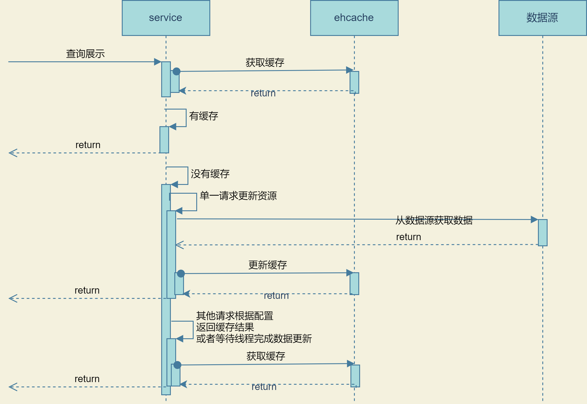
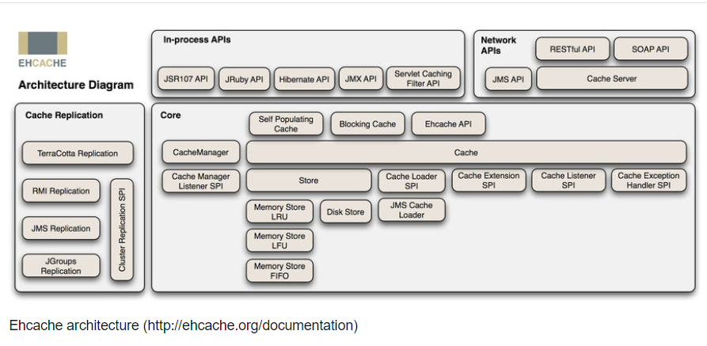

# 缓存

现有的spring cache与ehcache整合有点缺点，比如不能定义刷新时间，不能实现静默刷新（一个线程更新缓存，其他线程返回上次的缓存结果），基于此，开发了这个缓存项目

大致的业务图如下

业务流程图中主要是希望实现在并发的情况下只有一个线程去更新缓存，而其他线程等待第一个更新完成后返回更新后的数据，或者其他线程直接返回上一次缓存的结果。

查了下现有的缓存方案并没有类似的解决方案，所以单独做了个切面，对很多参数也可以做个性化的处理

*图片来自 https://www.researchgate.net/figure/Ehcache-architecture-http-ehcacheorg-documentation_fig3_331637365*

参考: https://www.ehcache.org/documentation/3.10/